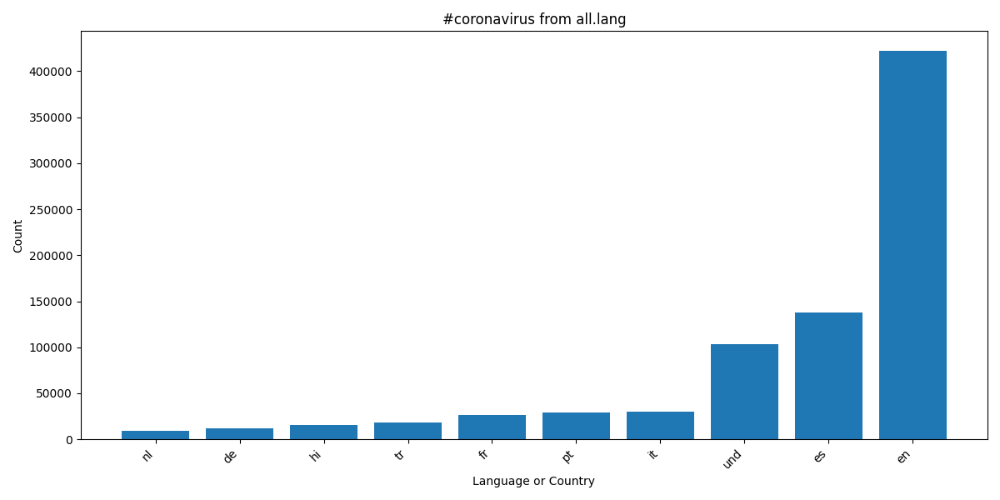
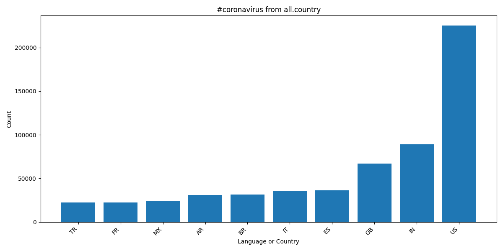
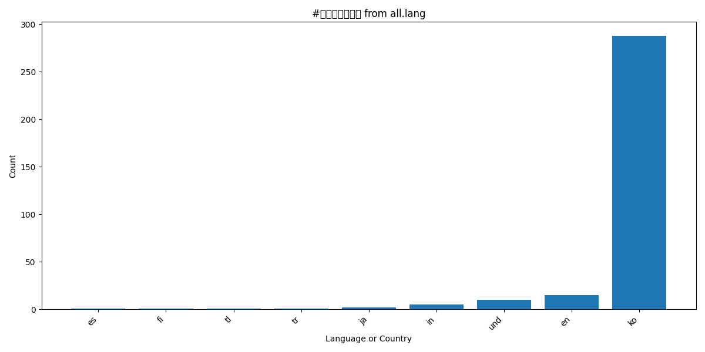
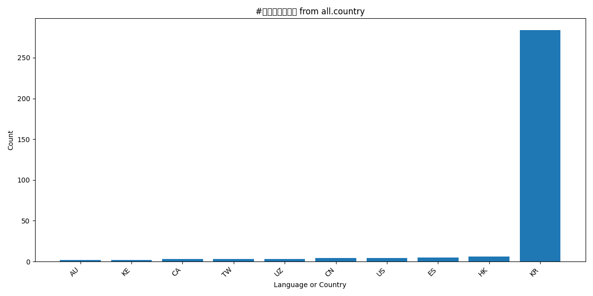
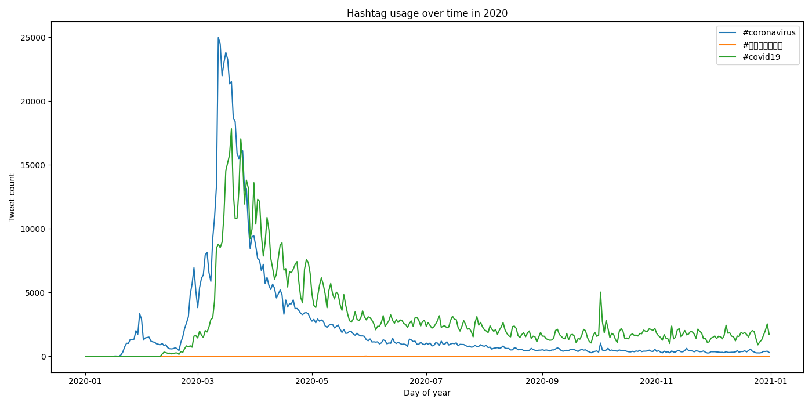

# Coronavirus Twitter Analysis

This project analyzes geotagged Twitter data from 2020 with a MapReduce-style workflow. I built a mapper that scans each daily archive, tracks coronavirus-related hashtag usage by both language and country, and writes intermediate outputs for parallel processing.

I then reduced those outputs into final aggregate files and generated visualizations showing how hashtags appeared across languages, countries, and over time. This project involved large-scale data processing, multilingual text analysis, shell process control with nohup/background jobs, and Python-based data visualization.

## Visualizations

### #coronavirus by language

### #coronavirus by country

### Korean coronavirus hashtag by language

### Korean coronavirus hashtag by country

### Hashtag usage over time

